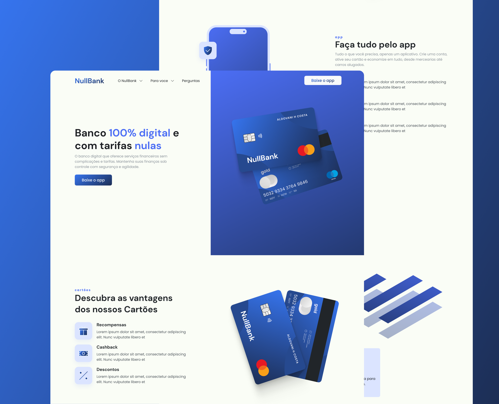

### NullBank

  <a href="#-tecnologias">Tecnologias</a>&nbsp;&nbsp;&nbsp;|&nbsp;&nbsp;&nbsp;
  <a href="#-projeto">Projeto</a>&nbsp;&nbsp;&nbsp;|&nbsp;&nbsp;&nbsp;
  <a href="#memo-licença">Licença</a>

 

  

## 🚀 Tecnologias

Esse projeto foi desenvolvido com as seguintes tecnologias:

- HTML
- SASS
- JavaScript

Bibliotecas

- [Google Fonts](https://fonts.google.com/)
- [SwipeJS](https://github.com/nolimits4web/Swiper)
- [AOS](https://michalsnik.github.io/aos/)

## 💻 Projeto

NullBank é uma página institucional moderna e responsiva, projetada para um banco fictício. Como uma página One Page, ela fornece todas as informações importantes em uma única página, tornando a navegação fácil e intuitiva.

## 📝 Licença

Esse projeto está sob a licença MIT. Veja o arquivo [LICENSE](.github/license.md) para mais detalhes.

---

Feito com ♥ by Aldovani :wave: 
